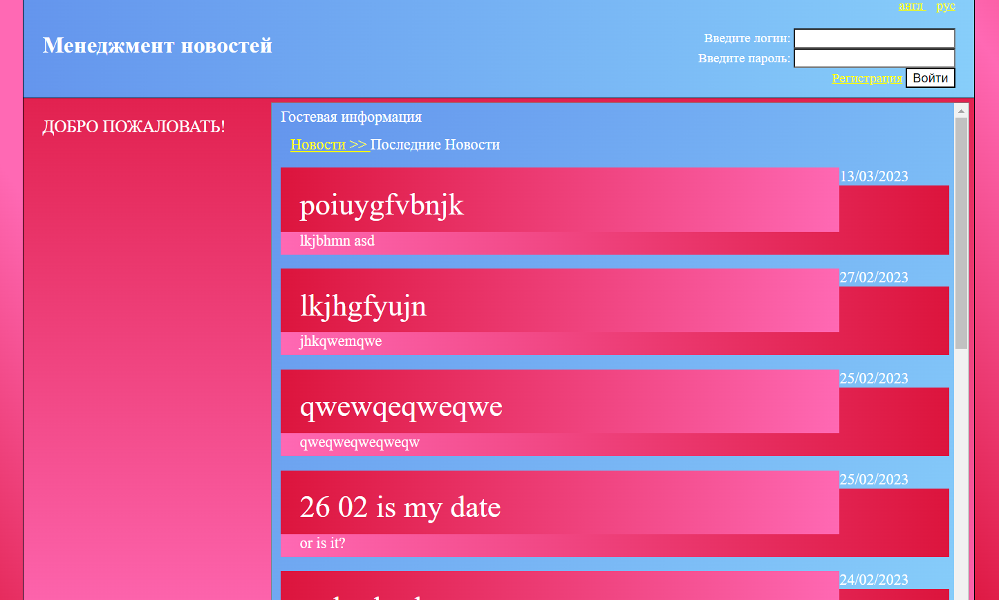
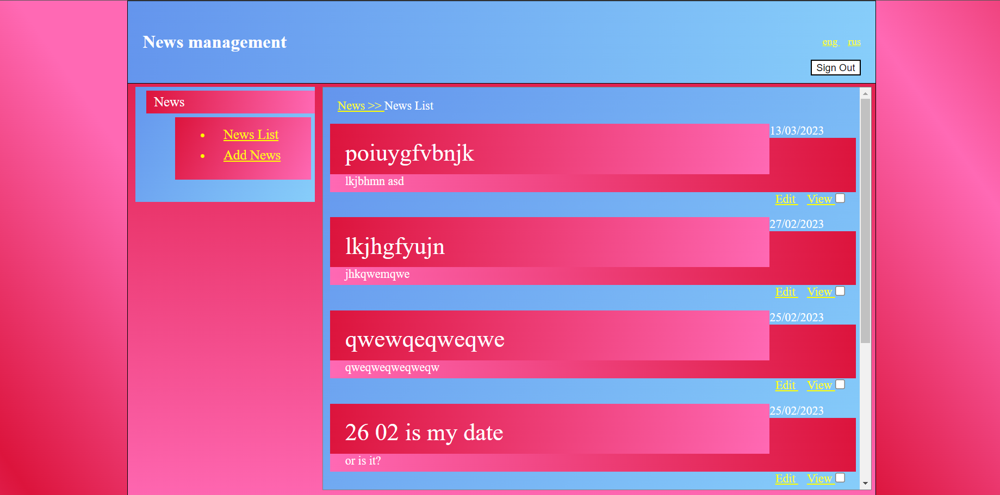
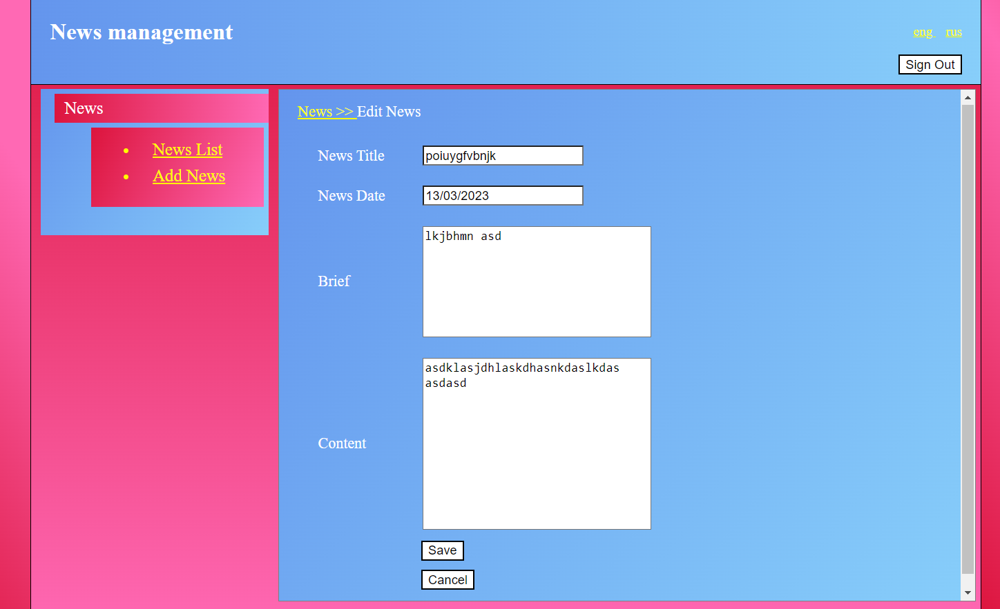

# news-webapp

# A simple Spring-free web app to learn Java servlets etc. 

The implementation follows MVC architecture guidelines. It is reliant on Jakarta servlets  
and an SQL database. JSP pages with JSTL tags are used for UI.

Guest news view: 
 
Admin news view: 
 
News editing view: 
 

## Some of the crucial use cases: 
-registration; 
-logination; 
-view news; 
-edit news; 
-add news; 
-delete news; 
-ru/eng localization; 

User roles: 
-guest; 
-user; 
-admin; 

